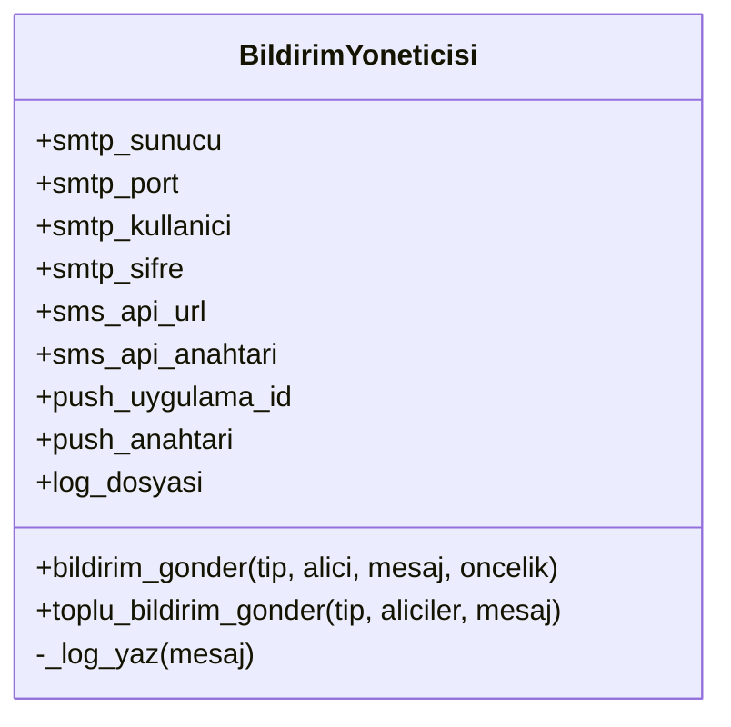
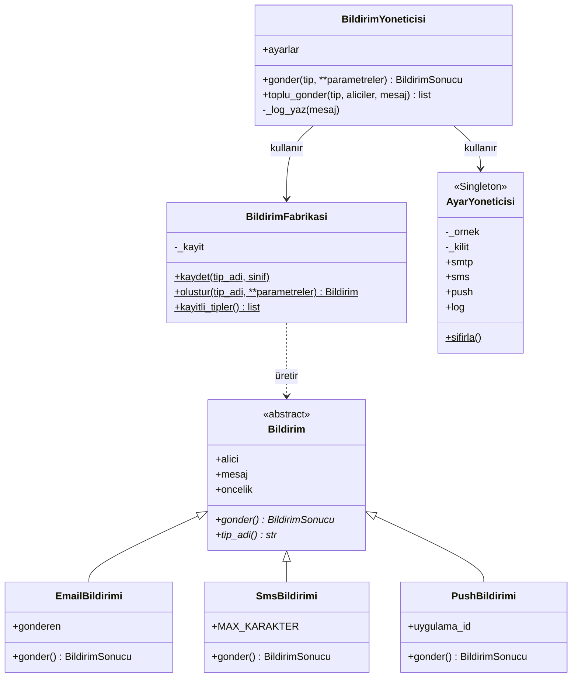

# Uygulanan Tasarım Örüntüleri

Bu belge, bildirim sisteminde her fazda uygulanan tasarım örüntülerinin
gerekçelerini, uygulama biçimlerini ve sağladığı kazanımları kayıt
altına alır. Her örüntü için "nerede, neden, ne kazandık" sorularına
yanıt verilir.

---

## Faz 1 — Creational Örüntüler

### 1. Factory Method

**Nerede uygulandı:**
`src/bildirim/bildirim_fabrikasi.py` — `BildirimFabrikasi` sınıfı.

**Neden seçildi:**
Eski sürümde `bildirim_gonder` metodu, tip bilgisine göre çalışan uzun
bir if-elif zinciri içeriyordu. Yeni bir bildirim tipi (örneğin
WhatsApp veya Discord) eklemek istendiğinde mevcut metodu doğrudan
değiştirmek gerekiyordu — bu da Açık/Kapalı Prensibinin (OCP) tipik bir
ihlaliydi. Factory Method, nesne yaratma sorumluluğunu çağrı kodundan
ayırarak bu sorunu kökten çözer.

**Uygulama özelliği:**
Klasik Factory Method örneklerinde fabrika içinde de bir if-elif zinciri
bulunur ("tip email ise EmailBildirimi döndür..."). Bu projede fabrika
**kayıt mekanizması** (registry) ile çalışacak şekilde tasarlandı.
Fabrika, somut sınıfları "bilmez"; sadece bir sözlük tutar. Yeni bir tip
eklemek için fabrika kodu değişmez, yalnızca yeni bir sınıf yazılır ve
`BildirimFabrikasi.kaydet("yeni_tip", YeniSinif)` çağrılır. Bu yaklaşım
fabrikanın kendisini de OCP-uyumlu hale getirir.

**Reddedilen alternatifler:**
- **Abstract Factory:** Bildirim aileleri (örneğin "kurumsal email +
  kurumsal SMS" vs "kişisel email + kişisel SMS") gibi bir gruplama
  ihtiyacı henüz yok. Abstract Factory bu aşamada erken ve gereksiz
  karmaşıklık getirirdi.
- **Builder:** Bildirim nesneleri parametre sayısı bakımından henüz
  karmaşık değil; Builder'ın faydası belirli bir eşik aşıldığında ortaya
  çıkar.

**Kazanımlar:**
- Yeni bildirim tipi eklemek mevcut kodu değiştirmeyi gerektirmiyor (OCP).
- Çağrı kodu somut sınıflara bağımlı değil, yalnızca `Bildirim` arayüzüne.
- Test ortamında sahte (mock) bildirim tipleri kolayca kaydedilebiliyor.

### 2. Singleton

**Nerede uygulandı:**
`src/bildirim/ayar_yoneticisi.py` — `AyarYoneticisi` sınıfı.

**Neden seçildi:**
SMTP, SMS, push ve loglama yapılandırmaları sistemin birden fazla
yerinden okunan, ancak yalnızca tek bir tutarlı sürümü olması gereken
verilerdir. Eski God Class'ta bu ayarlar constructor içinde sabit
kodlanmıştı; her `BildirimYoneticisi` örneği kendi kopyasını taşıyordu.
Singleton, yapılandırmanın tek bir kaynağa indirgenmesini sağlar.

**Uygulama özelliği:**
- `__new__` üzerinden klasik Singleton kurulumu.
- `threading.Lock` ile thread-safe başlatma — birden fazla thread aynı
  anda örnek istediğinde iki ayrı örnek yaratılmasının önüne geçilir.
- `_baslatildi` bayrağı, `__init__`'in her erişimde değerleri yeniden
  yüklemesini engeller.
- Test izolasyonu için açık bir `sifirla` yöntemi sunulur; Singleton'ın
  test edilebilirlik sorununa karşı bilinçli bir kaçış kapısıdır.

**Reddedilen alternatifler:**
- **Modül seviyesinde global değişken:** Python'da modüller doğal olarak
  Singleton gibi davranır. Ancak sınıf hâli, ilerideki olası
  genişletmeler (örneğin farklı ortamlar için alt sınıflar) için daha
  esnek bir yapı sunar.
- **Bağımlılık enjeksiyonu (DI):** Daha temiz bir alternatif olabilirdi,
  ancak projenin bu aşamasında bir DI altyapısı kurmak gerekçesiz
  karmaşıklık yaratırdı.

**Bilinçli risk:**
Singleton tartışmalı bir örüntüdür: global durum yaratır, test
izolasyonunu zorlaştırır ve birim testlerde "sıkı bağımlılık"
problemine yol açabilir. Bu projede ödev gereksinimi olarak ve
yapılandırma gibi sınırlı bir alanda kullanılmıştır. `sifirla` yöntemi,
bilinen test sorununu hafifletmek için eklenmiştir.

**Kazanımlar:**
- Yapılandırma tek bir noktadan yönetiliyor.
- Hassas bilgiler ortam değişkenlerinden okunuyor; kaynak koda
  gömülmedi.
- Sistemin her yerinden tutarlı yapılandırmaya erişiliyor.

---

## Önce / Sonra: Sınıf Diyagramı

### Önce (God Class)

### Sonra (Factory Method + Singleton)

## Faz 2 Structural Örüntüler

### 1. Decorator
**Nerede uygulandı:** `src/bildirim/dekoratorler.py`
**Neden seçildi:** OCP'yi bozmadan mevcut bildirim sınıflarına runtime'da "tekrar deneme" ve "maskeleme" gibi yeni yetenekler kazandırmak için.

### 2. Adapter
**Nerede uygulandı:** `src/bildirim/adaptorler.py`
**Neden seçildi:** Mevcut sistemimizin temiz bir arayüzü varken, dışarıdan aldığımız 3. parti SMS servisinin metodları tamamen farklıydı. Adaptör yazarak uyumsuzluğu giderdik.

## Faz 3 Behavioral Örüntüler

### 1. Strategy
**Nerede uygulandı:** `src/bildirim/stratejiler.py`
**Neden seçildi:** Gönderim şekillerini (anında, gecikmeli vs.) sınıftan bağımsız hale getirmek için. Açık/Kapalı Prensibini (OCP) tam olarak sağlar; yeni bir strateji eklemek için mevcut kodu değiştirmek gerekmez.

### 2. Observer
**Nerede uygulandı:** `src/bildirim/gozlemciler.py`
**Neden seçildi:** Bildirim gönderildikten sonra yapılacak ekstra işlemleri (loglama, analitik) ana akıştan ayırmak için. Sisteme yeni gözlemciler ekleyerek genişletilebilirliği artırır.
